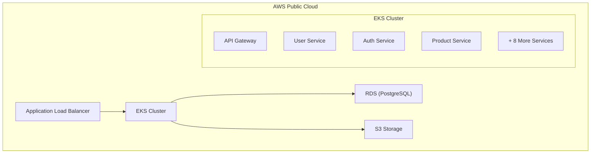
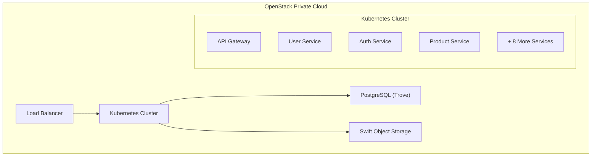

# 클라우드 DevOps 엔지니어 미니 프로젝트

## 프로젝트 개요
(주)엘리스 클라우드 DevOps 엔지니어 채용을 위한 미니 프로젝트로, **퍼블릭 클라우드(AWS)** 와 **프라이빗 클라우드(OpenStack)** 환경에서 마이크로서비스 운영을 위한 **Kubernetes 기반 DevOps 환경** 을 구축 및 비교 분석을 목표로 합니다.

## 프로젝트 일정
- **시작**: 2025년 7월 11일
- **마감**: 2025년 7월 13일 PM 11:59
- **소요 기간**: 3일

## 프로젝트 목표

### 1. 환경 구축
- **퍼블릭 클라우드**: AWS 기반 Kubernetes DevOps 환경
- **프라이빗 클라우드**: OpenStack 기반 Kubernetes DevOps 환경

### 2. 비교 분석
두 환경을 다음 4가지 측면에서 비교
- **관리 편의성** (Management Convenience)
- **민첩성** (Agility) 
- **비용 효율성** (Cost Efficiency)
- **보안** (Security)

## 기술적 요구사항

### 필수 조건
- ✅ **최소 10개 이상** 마이크로서비스 구성
- ✅ **모든 서비스 컨테이너화** 및 HTTP 요청 처리
- ✅ **PostgreSQL DBMS** (서비스별 분리된 데이터베이스)
- ✅ **S3 호환 Object Storage** (MinIO, Ceph Object Gateway 등)
- ✅ **High Availability (HA)** 모든 구성 요소에 적용
- ✅ **오토스케일링** 서비스 부하 기반 자동 확장
- ✅ **환경 일관성** Dev/Staging/Prod 환경 구축 가능
- ✅ **오픈소스 기반 CI/CD** 파이프라인
- ✅ **IaC (Infrastructure as Code)** 활용

## 기술 스택

### 퍼블릭 클라우드 (AWS)
| 구분 | 기술/서비스 |
|------|------------|
| **컨테이너 오케스트레이션** | Amazon EKS |
| **컴퓨팅** | EC2 |
| **데이터베이스** | RDS (PostgreSQL) |
| **스토리지** | S3 |
| **네트워킹** | VPC, ALB |
| **보안/권한** | IAM |
| **IaC** | Terraform |

### 프라이빗 클라우드 (OpenStack)
| 구분 | 기술/서비스 |
|------|------------|
| **클라우드 플랫폼** | OpenStack |
| **컨테이너 오케스트레이션** | Kubernetes (Magnum) |
| **컴퓨팅** | Nova |
| **데이터베이스** | PostgreSQL (Trove) |
| **스토리지** | Swift (S3 호환) |
| **네트워킹** | Neutron |
| **보안/권한** | Keystone |
| **IaC** | Heat, Terraform |

### 공통 도구
| 구분 | 기술/도구 |
|------|----------|
| **컨테이너** | Docker |
| **패키징** | Helm Charts |
| **CI/CD** | Jenkins, ArgoCD |
| **모니터링** | Prometheus, Grafana |
| **로깅** | ELK Stack |
| **백업** | Velero |

## 프로젝트 구조 (예상)

```
├── aws-public-cloud/           # AWS 퍼블릭 클라우드 구성
│   ├── terraform/              # AWS 인프라 IaC
│   ├── kubernetes/             # K8s 매니페스트
│   ├── microservices/          # 마이크로서비스 소스코드
│   └── ci-cd/                  # Jenkins, ArgoCD 설정
├── openstack-private-cloud/    # OpenStack 프라이빗 클라우드 구성
│   ├── openstack-setup/        # OpenStack 설치 스크립트
│   ├── kubernetes/             # K8s 매니페스트
│   ├── microservices/          # 마이크로서비스 소스코드
│   └── ci-cd/                  # CI/CD 파이프라인
├── docs/                       # 문서화
│   ├── architecture.md         # 아키텍처 설계
│   ├── comparison.md           # 환경 비교 분석
│   └── deployment-guide.md     # 배포 가이드
└── README.md                   # 프로젝트 개요
```

## 마이크로서비스 목록 (10개+)

1. **API Gateway** - 요청 라우팅 및 인증
2. **User Service** - 사용자 관리
3. **Auth Service** - 인증/인가
4. **Product Service** - 상품 관리
5. **Inventory Service** - 재고 관리
6. **Order Service** - 주문 처리
7. **Payment Service** - 결제 처리
8. **Notification Service** - 알림 발송
9. **Review Service** - 리뷰 관리
10. **Analytics Service** - 데이터 분석
11. **Log Aggregation Service** - 로그 수집
12. **Health Check Service** - 상태 체크

## 아키텍처 다이어그램

### AWS 퍼블릭 클라우드


### OpenStack 프라이빗 클라우드


## 실행 계획

### Day 1: AWS 환경 구축
- [ ] AWS 계정 설정 및 IAM 구성
- [ ] Terraform으로 VPC, EKS 클러스터 구축
- [ ] RDS PostgreSQL 인스턴스 생성
- [ ] 마이크로서비스 배포 (10개+)

### Day 2: OpenStack 환경 구축
- [ ] OpenStack 환경 설치 (DevStack/MicroStack)
- [ ] Kubernetes 클러스터 구성
- [ ] PostgreSQL, Swift 스토리지 설정
- [ ] 마이크로서비스 구성 및 배포 (10개+)

### Day 3: 통합 및 문서화
- [ ] CI/CD 파이프라인 구성
- [ ] 모니터링 시스템 구축
- [ ] 4가지 측면 비교 분석 문서 작성
- [ ] 최종 결과물 정리

## 제출물
- **소스코드**: 전체 IaC 및 애플리케이션 코드
- **문서**: 구축 가이드, 아키텍처 설명, 비교 분석
- **PDF 보고서**: 프로젝트 결과 및 분석 내용

---