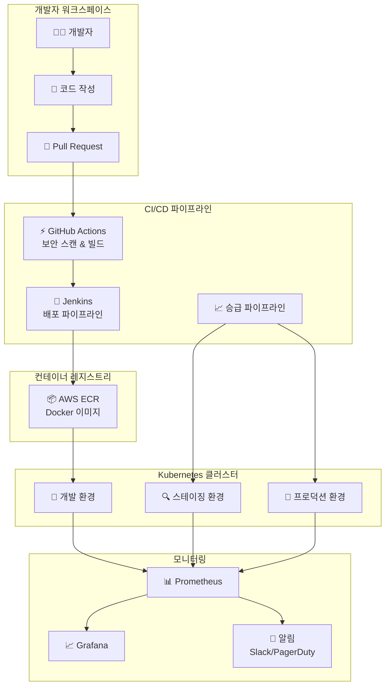
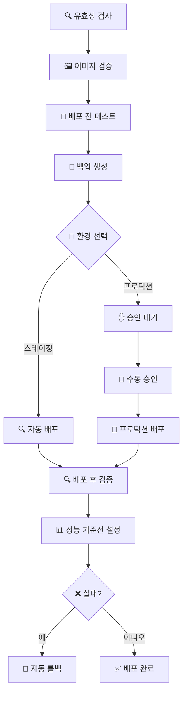
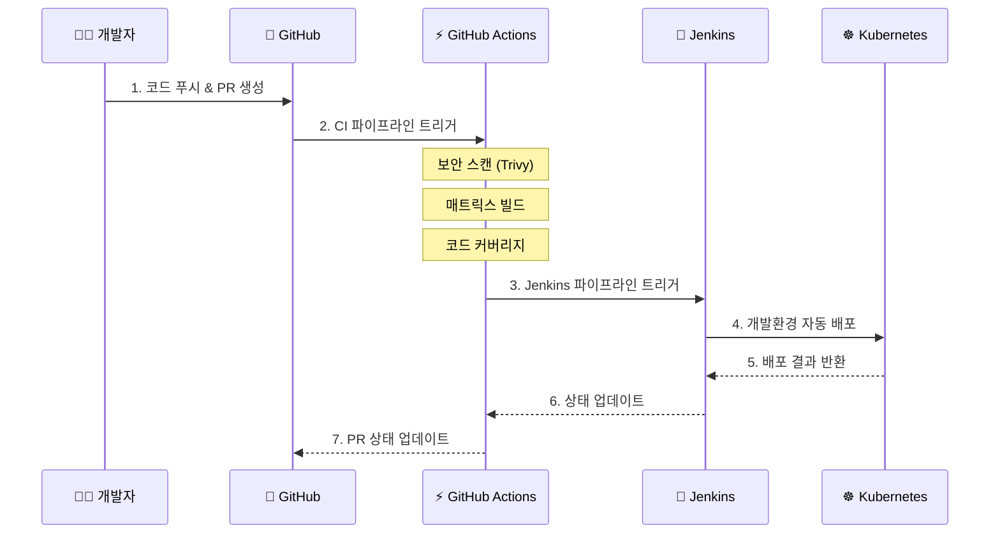
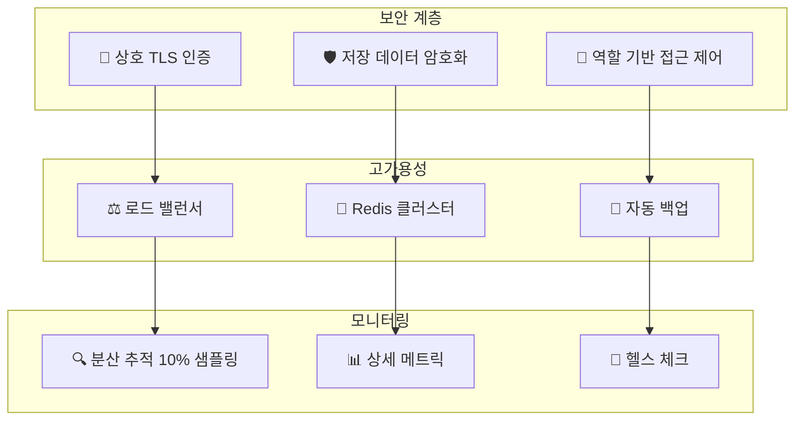
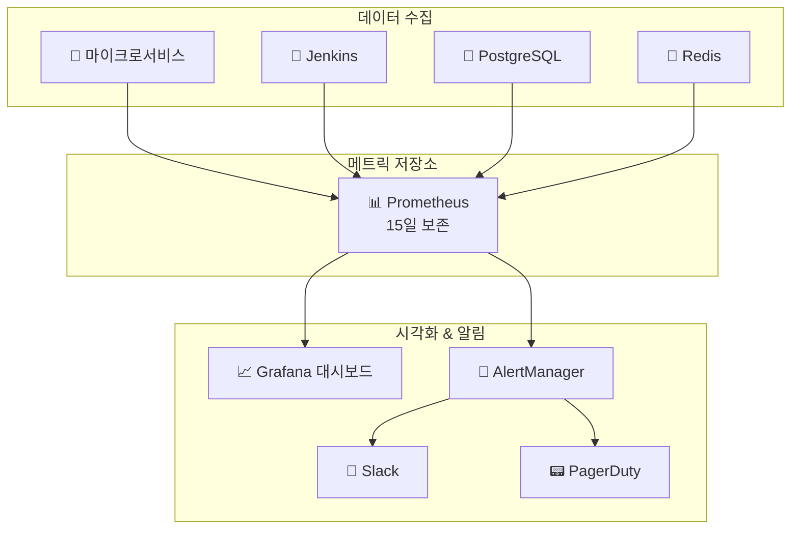

# 🚀 CI/CD 파이프라인 완벽 가이드


## 📋 목차
- [전체 아키텍처 개요](#전체-아키텍처-개요)
- [핵심 파이프라인 구성](#핵심-파이프라인-구성)
- [개발 워크플로우](#개발-워크플로우)
- [환경별 배포 전략](#환경별-배포-전략)
- [모니터링 및 알림](#모니터링-및-알림)
- [주요 구성 파일](#주요-구성-파일)

---

## 🏗️ 전체 아키텍처 개요



---

## 🔄 핵심 파이프라인 구성

### 1. 메인 CI/CD 파이프라인 (Jenkinsfile)

**목적**: 마이크로서비스의 주요 배포 파이프라인


**주요 특징**:
- 🔥 **uv**를 활용한 빠른 Python 패키지 관리
- 🔒 **병렬 코드 품질 검사** (ruff, mypy, bandit)
- 📦 **lockfile 자동 생성**으로 재현 가능한 빌드

### 2. 환경 승급 파이프라인 (Jenkinsfile.promotion)

**목적**: 개발 → 스테이징 → 프로덕션 승급 관리



**보안 특징**:
- 🛡️ **프로덕션 승인 게이트** - 수동 승인 후 배포
- 🔄 **자동 롤백** - 실패 시 즉시 이전 버전으로 복구
- 💨 **스모크 테스트** - 배포 후 즉시 기본 기능 확인

---

## 👨‍💻 개발 워크플로우

### GitHub Actions 통합 워크플로우



### 코드 품질 관리

**현대적 Python 도구 체인**:
- 🔥 **uv**: 빠른 Python 패키지 관리자 (pip보다 훨씬 빠름)
- 🧹 **ruff**: 빠른 Python 린터 & 포매터
- 🔍 **mypy**: 정적 타입 검사
- 🛡️ **bandit**: 보안 취약점 검사
- 🧪 **pytest**: 테스트 프레임워크

---

## 🌍 환경별 배포 전략

### 환경 구성 비교

| 환경 | 네임스페이스 | 오토스케일링 | 스토리지 | 로깅 레벨 | 특징 |
|------|-------------|--------------|----------|-----------|------|
| **개발** | `elice-devops-dev` | 1-3 replicas | MinIO | DEBUG | 🧪 빠른 개발 & 테스트 |
| **스테이징** | `elice-devops-stg` | 2-5 replicas | MinIO | INFO | 🔍 운영환경 시뮬레이션 |
| **프로덕션** | `elice-devops-prod` | 3-10 replicas | AWS S3 | WARN | 🌟 고가용성 & 보안 |

### 프로덕션 환경 보안 강화



---

## 📊 모니터링 및 알림

### Prometheus 기반 모니터링 스택



### 핵심 알림 규칙

**🚨 서비스 상태 모니터링**:
- 서비스 다운 (즉시 알림)
- 높은 에러율 (5분 이상 5% 초과)
- 응답 지연 (평균 응답시간 1초 초과)

**⚡ 리소스 사용량**:
- CPU 사용률 80% 초과
- 메모리 사용률 85% 초과
- 디스크 사용률 90% 초과

**💼 비즈니스 메트릭**:
- 사용자 로그인 실패율 급증
- API 호출량 급격한 변화
- 데이터베이스 연결 풀 고갈

---

## 📁 주요 구성 파일

### 🔧 CI/CD 파이프라인

#### 핵심 파이프라인 파일
- **`/Jenkinsfile`** - 마이크로서비스 메인 CI/CD 파이프라인
  - 체크아웃 → uv 설정 → Python 빌드 → 코드 품질 검사 → 테스트 → Docker 빌드 → 개발환경 배포 → 헬스체크
  - 현대적 Python 도구(uv) 사용, lockfile 생성, 병렬 코드 품질 검사 지원

- **`/Jenkinsfile.promotion`** - 환경 승급 파이프라인 (dev→staging→production)
  - 검증 → 이미지 확인 → 배포 전 테스트 → 백업 → 배포 → 배포 후 검증 → 성능 기준선 설정
  - 프로덕션 승인 게이트, 자동 롤백, 스모크 테스트 기능

- **`.github/workflows/ci.yml`** - GitHub Actions CI 파이프라인
  - 변경사항 감지 → 보안 스캔 → 매트릭스 빌드 → 테스트 커버리지 → Jenkins 트리거 → 릴리스 생성
  - Trivy 보안 스캔, 병렬 서비스 빌드, 코드 커버리지 리포팅

#### Jenkins 설정 파일
- **`/jenkins/Dockerfile`** - 커스텀 Jenkins Docker 이미지
  - uv, kubectl, docker-compose 사전 설치
  - 플러그인 자동 설치, JCasC(Jenkins Configuration as Code) 지원
  - 프로덕션 Jenkins 배포용 베이스 이미지

- **`/jenkins/jenkins.yaml`** - Jenkins Configuration as Code (JCasC) 설정
  - 멀티브랜치 파이프라인, GitHub 통합, 자격 증명 관리
  - Prometheus 메트릭, Slack 알림 설정
  - RBAC, 보안 자격 증명 처리

- **`/jenkins/plugins.txt`** - Jenkins 플러그인 버전 정의
  - 파이프라인 플러그인, SCM 통합, Docker/Kubernetes, 코드 품질, 모니터링 플러그인
  - 재현 가능한 빌드를 위한 버전 고정

### 🐳 컨테이너 및 애플리케이션

#### Docker 컨테이너 파일
- **`/aws/microservices/api-gateway/Dockerfile`** - API Gateway 서비스 멀티스테이지 Docker 빌드
  - uv 기반 의존성 관리, non-root 사용자, 헬스체크, 최적화된 캐싱
  - 최소한의 공격면, 적절한 사용자 권한으로 보안 강화

- **`/aws/microservices/api-gateway/pyproject.toml`** - 현대적 Python 프로젝트 설정
  - 빌드 시스템(hatchling), 프로덕션 및 개발 의존성 정의
  - ruff, mypy, pytest 도구 설정 포함
  - uv와 연동하여 빠른 의존성 해결

#### 의존성 관리
- **`/aws/microservices/api-gateway/requirements.lock`** - 프로덕션 의존성 버전 고정
- **`/aws/microservices/api-gateway/requirements-dev.lock`** - 개발 의존성 버전 고정
  - Jenkins 파이프라인에서 `uv pip compile`로 생성
  - 모든 환경에서 일관된 의존성 버전 보장

### ☸️ Kubernetes 배포 매니페스트

#### 환경별 배포 설정
- **`/aws/kubernetes/dev/*.yaml`** - 개발환경 Kubernetes 배포 매니페스트
- **`/aws/kubernetes/stg/*.yaml`** - 스테이징환경 Kubernetes 배포 매니페스트  
- **`/aws/kubernetes/prod/*.yaml`** - 프로덕션환경 Kubernetes 배포 매니페스트
  - 12개 마이크로서비스 각각의 환경별 설정
  - 환경별 네임스페이스 분리 (elice-devops-{env})
  - 리소스 제한, 헬스체크, 서비스 디스커버리, 환경별 설정 적용

#### 모니터링 설정
- **`/aws/kubernetes/monitoring/prometheus.yaml`** - Prometheus 배포 매니페스트
- **`/aws/kubernetes/monitoring/grafana.yaml`** - Grafana 배포 매니페스트
- **`/aws/kubernetes/monitoring/rbac.yaml`** - 모니터링 RBAC 권한 설정
  - RBAC 권한, 영구 저장소, 설정 관리
  - 모든 마이크로서비스 메트릭 수집

#### 스토리지 설정
- **`/aws/kubernetes/storage/minio-pvc.yaml`** - MinIO PVC 스토리지 (스테이징용)
- **`/aws/kubernetes/storage/minio-emptydir.yaml`** - MinIO emptyDir 스토리지
- **`/aws/kubernetes/storage/minio-deployment.yaml`** - MinIO 배포 설정
  - S3 호환 스토리지, 다양한 스토리지 백엔드 지원

### 🌐 환경 설정

#### 스테이징 환경
- **`/environments/staging/values.yaml`** - 스테이징 환경 설정
  - 적당한 리소스 할당 (오토스케일링 2-5 replicas)
  - MinIO 스토리지, 통합 테스트 설정
  - INFO 로깅, 10% 추적 샘플링

#### 프로덕션 환경  
- **`/environments/production/values.yaml`** - 프로덕션 환경 설정
  - 고가용성 설정 (오토스케일링 3-10 replicas)
  - AWS S3 스토리지, Redis 클러스터링, 백업/복구
  - mTLS, 저장 데이터 암호화, 보수적 기능 플래그

### 📊 모니터링 및 관찰성

#### Prometheus 설정
- **`/monitoring/prometheus/values.yaml`** - 종합적인 Prometheus 설정
  - 15일 보존기간, 서비스 디스커버리, AlertManager 연동
  - PagerDuty/Slack 통합 알림
  - Jenkins, 마이크로서비스, PostgreSQL, Redis 익스포터 수집

#### 알림 규칙
- **`/monitoring/alerts/elice-rules.yaml`** - 프로덕션용 알림 규칙
  - 서비스 상태, 에러율, 지연시간, 리소스 사용량, 비즈니스 메트릭 모니터링
  - Warning → Critical → PagerDuty 에스컬레이션

#### 대시보드
- **`/monitoring/grafana/dashboards/elice-overview.json`** - 시스템 개요 대시보드
  - 서비스 상태, 요청률, 에러율, 응답시간, 리소스 사용량 시각화
  - 30초 새로고침으로 실시간 모니터링
### 🛠️ 자동화 스크립트

#### 시스템 관리 스크립트
- **`/scripts/health-check.sh`** - 종합적인 시스템 상태 검증 스크립트
  - Pod 상태, 서비스 엔드포인트, 리소스 사용량, 헬스 URL, 데이터베이스/Redis 연결성 검사
  - 사용법: `./health-check.sh prod --verbose`

- **`/scripts/setup-github-integration.sh`** - GitHub 저장소 CI/CD 설정 자동화
  - 브랜치 보호, 웹훅 설정, 시크릿 관리, PR 템플릿 구성
  - GitHub → Jenkins → Kubernetes 전체 플로우 설정

#### 인프라 관리 스크립트
- **`/aws/microservices/ecr-push.sh`** - ECR 저장소 관리 및 Docker 이미지 빌드
  - 병렬 빌드, 라이프사이클 관리, 환경 간 이미지 승급
  - 사용법: `./ecr-push.sh build-all prod --parallel`

- **`/aws/terraform/Makefile`** - 인프라 배포 자동화
  - dev, staging, production 환경별 plan/apply 명령
  - 프로덕션은 명시적 확인 필요로 안전장치 제공

---

## ⚡ 시작하기

### 1. 헬스 체크 실행
```bash
# 프로덕션 환경 상태 확인
./scripts/health-check.sh prod --verbose
```

### 2. 전체 서비스 빌드
```bash
# 모든 마이크로서비스 병렬 빌드
./aws/microservices/ecr-push.sh build-all prod --parallel
```

### 3. 인프라 배포
```bash
# Terraform으로 인프라 구축
cd aws/terraform
make plan-prod    # 계획 확인
make apply-prod   # 적용 (승인 필요)
```

---

## 🎯 핵심 장점

✅ **빠른 빌드** - uv와 최신 도구로 빌드 시간 대폭 단축  
✅ **완전 자동화** - 코드 푸시부터 배포까지 원클릭 자동화  
✅ **강력한 보안** - 다중 보안 스캔과 승인 게이트  
✅ **실시간 모니터링** - 포괄적인 관찰가능성과 즉시 알림  
✅ **무중단 배포** - 자동 롤백과 헬스 체크  
✅ **확장성** - 12개 마이크로서비스 지원 가능한 아키텍처  

---