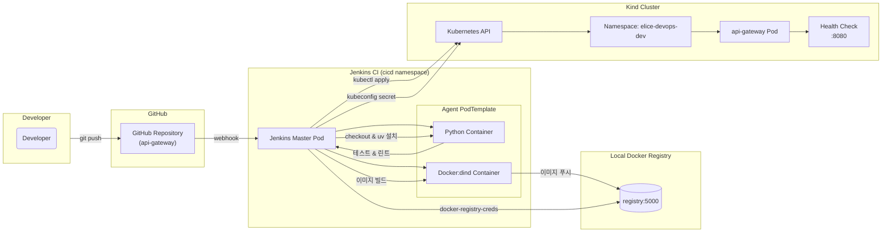

# Jenkins CI 파이프라인 설정 가이드

## 목차

- [Jenkins CI 파이프라인 설정 가이드](#jenkins-ci-파이프라인-설정-가이드)
  - [목차](#목차)
  - [사전 준비 사항](#사전-준비-사항)
  - [Jenkins 구성 단계](#jenkins-구성-단계)
    - [1. 필수 플러그인 설치](#1-필수-플러그인-설치)
    - [2. 자격증명(Credentials) 설정](#2-자격증명credentials-설정)
    - [3. 파이프라인 잡 생성](#3-파이프라인-잡-생성)
    - [4. 파이프라인 테스트](#4-파이프라인-테스트)
  - [Architecture](#architecture)
  - [문제 해결](#문제-해결)
    - [자주 발생하는 이슈](#자주-발생하는-이슈)
    - [디버그 명령어](#디버그-명령어)
  - [다음 단계](#다음-단계)

## 사전 준비 사항

1. **로컬 Docker 레지스트리 실행**

   ```bash
   docker run -d -p 5000:5000 --name registry registry:2
   curl http://localhost:5000/v2/   # 레지스트리가 실행 중인지 확인
   ```

2. **Jenkins가 설치된 Kind 클러스터**

   ```bash
   # Jenkins 파드가 실행 중인지 확인
   kubectl get pods -n default | grep jenkins
   # 로컬 머신에서 Jenkins UI 포트 포워딩
   kubectl port-forward svc/jenkins 8080:8080
   ```

---

## Jenkins 구성 단계

### 1. 필수 플러그인 설치

Jenkins 관리 → 플러그인 관리 로 이동하여 다음 플러그인을 설치하세요:

* Blue Ocean Pipeline
* Docker Workflow
* Kubernetes
* Git
* Pipeline Utility Steps
* Build Timeout
* Timestamper
* Workspace Cleanup
* AnsiColor
* JUnit
* Cobertura
* HTML Publisher
* Credentials Binding

---

### 2. 자격증명(Credentials) 설정

Jenkins 관리 → 자격증명 관리 → 전역(Global)에서 아래 항목을 추가하세요.

**Kubeconfig (비밀 파일)**

* ID: `kubeconfig`
* 설명: Kind 클러스터용 Kubernetes 설정
* 파일: `~/.kube/config` 업로드

**Docker Registry (사용자명/비밀번호)**

* ID: `docker-registry-creds`
* 사용자명: `admin`
* 비밀번호: `admin`
* 설명: 로컬 Docker 레지스트리

---

### 3. 파이프라인 잡 생성

1. Jenkins UI에서 **New Item** 클릭 → **Pipeline** 선택
2. 이름(Name): `api-gateway-ci` 입력
3. Pipeline 정의: **Pipeline script from SCM** 선택
4. SCM: **Git**
5. Repository URL: 본인 프로젝트 Git URL 입력
6. Branch: `*/main`
7. Script Path: `Jenkinsfile`

---

### 4. 파이프라인 테스트

1. 파이프라인 실행
2. Blue Ocean 또는 콘솔 출력에서 로그 모니터링
3. 다음 단계가 순서대로 완료되었는지 확인:

   * 체크아웃(Checkout)
   * uv 설치
   * Python 환경 설정
   * 의존성 잠금(Lock Dependencies)
   * 코드 품질 검사(Lint, 타입 검사, 보안 스캔)
   * 테스트(Test)
   * Docker 이미지 빌드(Build Docker Image)
   * 개발 환경 배포(Deploy to Dev)
   * 헬스체크(Health Check)

---

## Architecture



---

## 문제 해결

### 자주 발생하는 이슈

1. **uv 명령어를 찾을 수 없음**

   * `$HOME/.local/bin`이 `PATH`에 포함되어 있는지 확인하세요.

2. **Docker 레지스트리 연결 문제**

   * 레지스트리가 `5000`번 포트에서 정상 실행 중인지 확인하세요.

3. **Kubernetes 접근 오류**

   * `kubeconfig` 자격증명이 올바르게 설정되어 있는지 검토하세요.

4. **Python 버전 문제**

   * 파이프라인이 Python 3.11 이상과 호환되는 패키지를 사용하도록 설정되어 있는지 확인하세요.

---

### 디버그 명령어

```bash
# Jenkins 파드 로그 확인
kubectl logs -f deployment/jenkins -n cicd

# 로컬 레지스트리 상태 확인
curl http://localhost:5000/v2/_catalog

# uv 설치 확인
export PATH="${HOME}/.local/bin:$PATH"
uv --version
```

---

## 다음 단계

* 브랜치 보호 및 PR 트리거 추가
* GitHub 웹훅 연동
* 스테이징/프로덕션 환경 배포 파이프라인 구성
* 알림 시스템(슬랙, 이메일 등) 설정
* 성능 테스트 단계 추가

지금까지 설정이 완료되었으면, 해당 가이드를 참고하여 파이프라인을 안정적으로 운영해 보세요!
